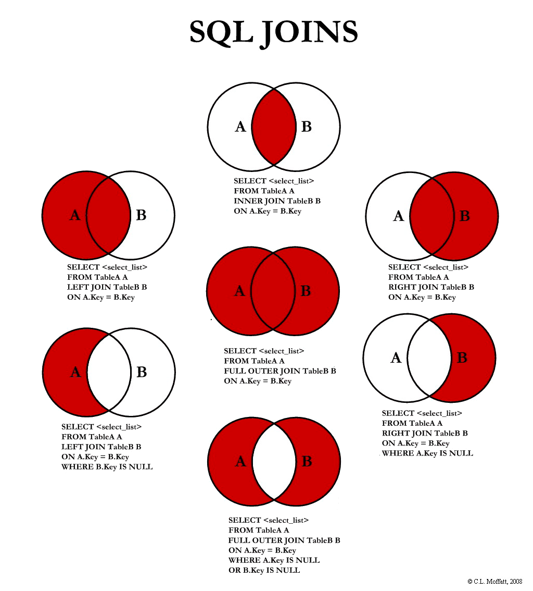

# SQL DEEP DIVE

## 01 Exercise Simple Queries

```SQL
-- Give me a list of all employees in the company
-- SELECT * FROM "public"."employees";
SELECT * FROM "employees";

-- How many departments are there in the company?
SELECT * FROM "public"."departments";

-- How many times has employee 10001 had a raise?
SELECT * FROM "public"."salaries"
WHERE emp_no = 10001;

-- What titles does 10006 have?
SELECT * FROM "public"."titles"
WHERE emp_no = 10006;
```

## 02 Changing Column Names in a SELECT Query

```SQL
SELECT emp_no AS "Employee #", birth_date AS "Birthday", first_name AS "First name"
FROM "public"."employees";
```

## 03 Concat Function

```SQL
-- CONCAT(TEXT, TEXT)
-- CONCAT(COLUMN1, COLUMN2)

SELECT CONCAT(emp_no, ' is a ', title) AS "Employee Title"
FROM titles;

-- Question
-- Concatenate the first and last name of the employee into a one column
-- Rename the concatenated column
SELECT emp_no, CONCAT(first_name, ' ', last_name) AS "FullName"
FROM employees;
```

## 04 Aggregate Functions

```SQL
-- AVG() - calculates the average of a set of values.
-- COUNT() - counts rows in a specified table or view.
-- MIN() - gets the minimum value in a set of values.
-- MAX() - gets the maximum value in a set of values.
-- SUM( ) - calculates the sum of values.

SELECT COUNT(emp_no) FROM employees;
SELECT MIN(emp_no) FROM employees;
SELECT MAX(emp_no) FROM employees;

-- Question 1:
-- Get the highest salary available
SELECT MAX(salary) FROM salaries;

-- Question 2:
-- Get the total amount of salaries paid
SELECT SUM(salary) FROM salaries;
```

## 05 Commenting Your Queries

```SQL
-- Question
-- Select the employee with the name "Mayumi Schueller"

-- select statement to filter Mayumi Schueller
SELECT first_name, last_name FROM public.employees
/*
filtter on first name AND last name to limit the amount of data returned
and focus the filttering on a single person
*/
WHERE first_name = 'Mayumi' AND last_name = 'Schueller';
```

## 06 Filtering Data

```SQL
-- Question
-- Get the list of all female employees

SELECT first_name FROM employees
WHERE gender = 'F';
```

## 07 AND and OR

```SQL
SELECT first_name, last_name, hire_date FROM employees
WHERE (first_name = 'Georgi' AND last_name = 'Facello' AND hire_date = '1986-06-26')
OR (first_name = 'Bezalel' AND last_name = 'Simmel');
```

## 08 Exercise Filtering Data

```SQL
-- Question
-- How many female customers do we have the state of Oregon (OR)
-- AND New York (NY)

SELECT COUNT(*) FROM customers
WHERE gender = 'F' AND (state = 'OR' OR state = 'NY')
```

## 09 The NOT Keyword

```SQL
-- Question
-- How many customers aren't 55?
SELECT COUNT(*) FROM customers
WHERE NOT age = 55;
```

## 10 Comparison Operators

```SQL
-- = : EQUAL
-- !=, <> : NOT EQUAL
-- > : GREATER
-- < : LESS
-- >= : GREATER OR EQUAL
-- <= : LESS OR EQUAL
```

## 11 Checking For NULL Values

```SQL
SELECT NULL = NULL;
SELECT 1 = 1
```

## 12 NULL Coalescing

```SQL
-- coalesce(<column>, value)
-- ability to replace NULL values to operate on the data
```

## 13 IN Keyword

```SQL
SELECT * FROM employees
WHERE emp_no IN (10001, 10006, 11008);
```

## 14 LIKE

```SQL
-- LIKE '%2' - Fields that end with 2
-- LIKE '%2%' - Fields that have 2 anywhere in the value
-- LIKE '_00%' - Fields that have 2 zero's as the second and third character and anything after
-- LIKE '%200%' - Fields that have 200 anywhere in the value
-- LIKE '2_%_%' - Finds any values that start with 2 and are at least 3 characters in length
-- LIKE '2___3' - Finds any values in a five-digit number that start with 2 and end with 3

-- Casting is the act of changing something to something else
-- CAST(salary AS text)
-- salary::text

SELECT * FROM employees
WHERE first_name LIKE 'G%ger';

SELECT * FROM employees
WHERE first_name ILIKE 'G%GER';
-- ILIKE - is not casesensitive
```

## 15 TIMEZONE

```SQL
SHOW TIMEZONE;
SET TIME ZONE 'UTC';
ALTER USER postgres SET timezone = 'UTC;
```

## 16 Timestamps

```SQL
CREATE TABLE timezone(
 ts TIMESTAMP WITHOUT TIME ZONE,
 tz TIMESTAMP WITH TIME ZONE
);

INSERT INTO timezone VALUES(
 TIMESTAMP WITHOUT TIME ZONE '2000-01-01 10:00:00-05',
 TIMESTAMP WITH TIME ZONE '2000-01-01 10:00:00-05'
);

SELECT * FROM timezone;
```

## 17 Date Functions

```SQL
SELECT now()::date;
SELECT CURRENT_DATE;

SELECT TO_CHAR(CURRENT_DATE, 'dd/mm/yyyy');
SELECT TO_CHAR(CURRENT_DATE, 'DDD');
SELECT TO_CHAR(CURRENT_DATE, 'IDDD');
SELECT TO_CHAR(CURRENT_DATE, 'WW');

SELECT now() - '1800/01/01';

-- Calculate the age
SELECT AGE(date '1800-01-01');
SELECT AGE(date '1920-01-01', date '1800-01-01');

-- Extract information
SELECT EXTRACT(DAY FROM date '1992/11/13') AS DAY;
SELECT EXTRACT(MONTH FROM date '1992/11/13') AS MONTH;
SELECT EXTRACT(YEAR FROM date '1992/11/13') AS YEAR;

-- round the date
SELECT DATE_TRUNC('year', date '1992/11/13');
SELECT DATE_TRUNC('month', date '1992/11/13');
SELECT DATE_TRUNC('day', date '1992/11/13');

-- interval
-- allows us to write queries in a way that mirrors language
SELECT *
FROM <table_name>
WHERE purchaseDate <= now() - INTERVAL '30 days'

INTERVAL '1 year 2 months 3 days';
INTERVAL '2 weeks ago';
INTERVAL '1 year 3 hours 20 minutes';

SELECT
    EXTRACT(
        year
        FROM
            INTERVAL '5 years 20 months'
    ) -- 6
```

## 18 DISTINCT

```SQL
SELECT DISTINCT salary, from_date FROM salaries;
```

## 19 Sorting Data

```SQL
SELECT first_name, last_name FROM employees
ORDER BY first_name, last_name DESC;

SELECT first_name, last_name FROM employees
ORDER BY LENGTH(first_name) DESC;
```

## 20 Join

```SQL
SELECT a.emp_no, b.salary
FROM employees as a, salaries as b
WHERE a.emp_no = b.emp_no;

-- INNER JOIN
SELECT a.emp_no, b.salary
FROM employees as a
INNER JOIN salaries as b ON b.emp_no = a.emp_no;

--
SELECT a.emp_no,
	   CONCAT(a.firs_name, a.last_name) AS "name",
	   b.salary,
	   c.title,
	   c.from_date AS "promoted on"
FROM employees AS a
INNER JOIN salaries AS b ON a.emp_no = b.emp_no
INNER JOIN titles AS c ON c.emp_no = a.emp_no
AND c.from_date = (b.from_date + interval '2 days')
ORDER BY a.emp_no;

--
SELECT a.emp_no,
	   CONCAT(a.firs_name, a.last_name) AS "name",
	   b.salary,
	   COALESCE(c.title, 'NO title change'),
	   COALESCE(c.from_date::text, '-') AS "title taken on"
FROM employees AS a
INNER JOIN salaries AS b ON a.emp_no = b.emp_no
INNER JOIN titles AS c
ON c.emp_no = a.emp_no AND (
	c.from_date = (b.from_date + interval '2 days') OR
	c.from_date = b.from_date
)
ORDER BY a.emp_no;

-- SELF JOIN
SELECT a.id, a.name AS "employee", b.name AS "supervisor name"
FROM employee AS a, employee AS b
WHERE a.sipervisorId = b.id;

-- OUTER JOIN
SELECT COUNT(emp.emp_no)
FROM employee AS emp
LEFT JOIN dept_manager AS dep ON emp.emp_no = dep.emp_no
WHERE dep.emp_no IS NULL;

--
SELECT a. emp_no,
	   CONCAT(a.first_name, a. last_name) as "name",
	   b.salary,
	   coalesce(c.title, 'No title change'),
	   COALESCE(c.from_date: : text, '-') AS "title taken on"
FROM employees AS a
INNER JOIN salaries AS b ON a.emp_no = b.emp_no
LEFT JOIN titles AS c
ON c.emp_no = a.emp_no AND (
   c.from_date = (b.from_date + interval '2 days' ) OR
   c.from_date = b.from_date
)
ORDER BY a.emp_no;

-- CROSS JOIN
-- create a combination of every row

-- FULL JOIN
-- return result from both whether they match or not

--
SELECT e.emp_no, e.first_name, de.dept_no, d.dept_name
FROM employees AS e
INNER JOIN dept_emp AS de USING(emp_no)
INNER JOIN departments AS d USING(dept_no)
```


